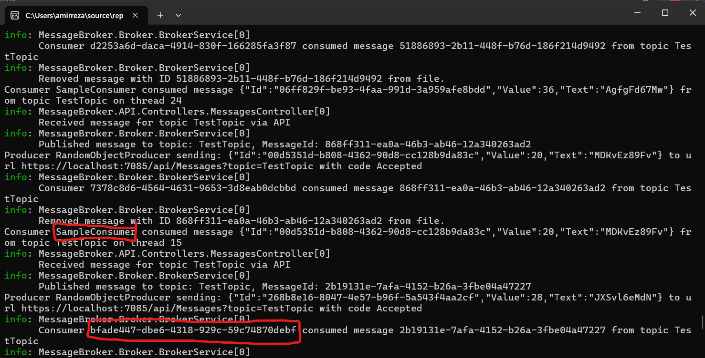
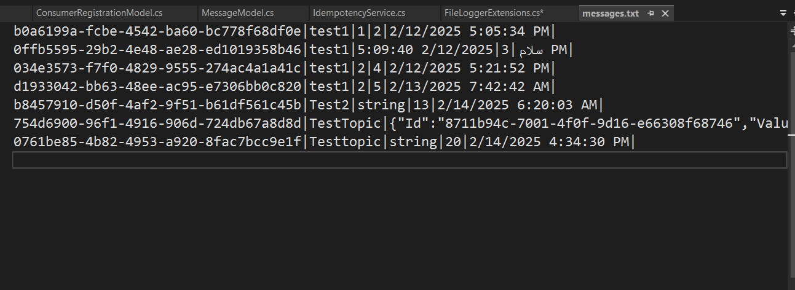
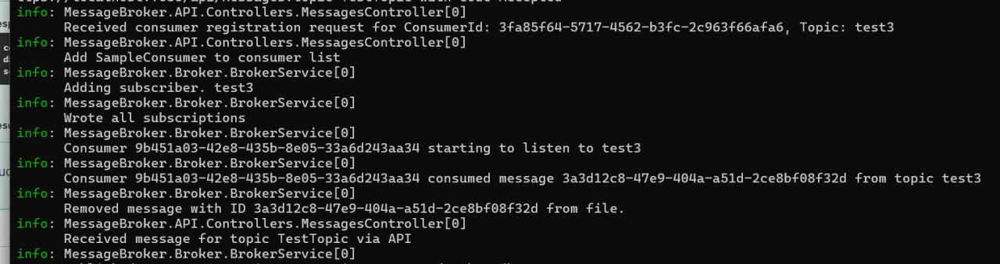
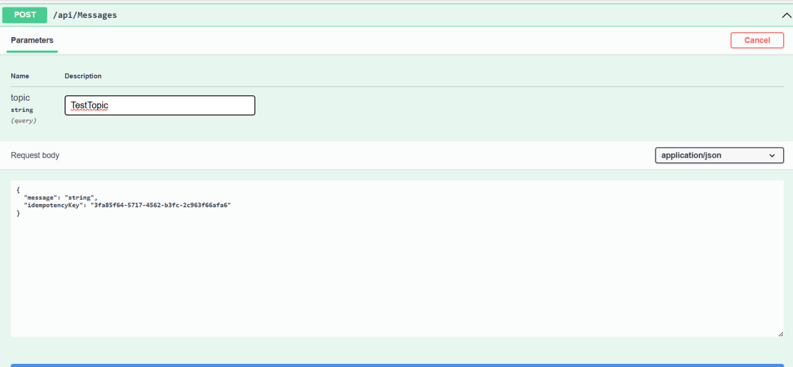
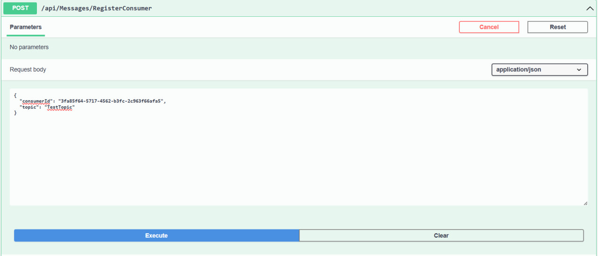
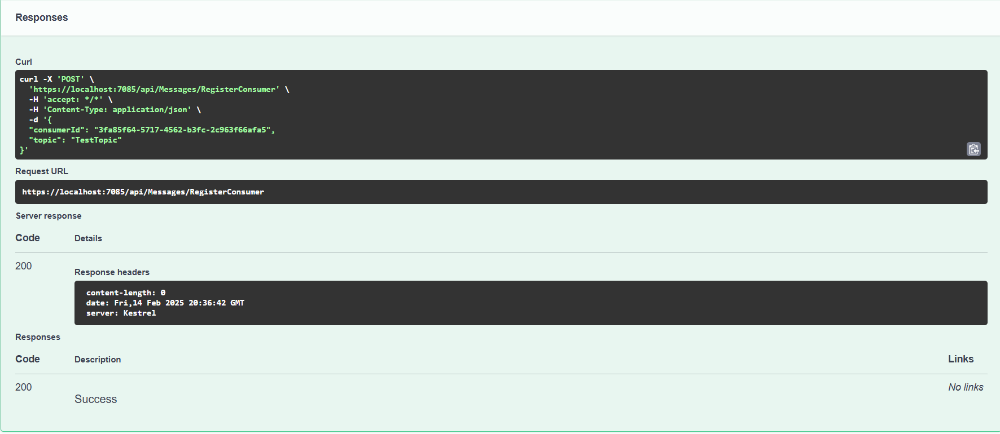

# MessageBroker
select .Broker and .API as startup projects.
each project have some nuggets that you should install. click on each project to see them, then right click and go to nugget management to install them.

after starting project, in swagger that is opened give request with /api/Messages/RegisterConsumer to "TestTopic", so the simulation get started. 
you can change the id of consumer to have multiple consumers. remeber the json format of id should not change. 


pub/sub pattern


idempotent api endpoints.

retry mechanism 
if it could not publish it gives error with status code, trying in  intervals again.

threadcount and ratelimit to control concurrency and resource limitation.

persitancy is assured , all messages saved in .txt file till they are consumed.

by defalut producer and consumer will produce/listen to TestTopic , if you want to change that . you can either give api request to publish some message to another topic like "test3". and then make a request with consumer api to listen to test3.


I have used this algorithm to have multiple consumers:
```bash

Claim Check: The broker stores the message's metadata (e.g., message ID, topic) in a special "claim check" area (either in-memory or in a data store with atomic operations).
Atomic Claim Attempt: When a consumer wants to consume a message, it performs an atomic operation to "claim" the message by associating its consumer ID with the message's metadata in the claim check area. (Atomic is the idea that if you add 1 to the number 1 it isn't possible to land on a number that isn't 2)
Success/Failure:
If the claim attempt succeeds (meaning no other consumer has claimed the message), the consumer proceeds to process the message.
If the claim attempt fails (meaning another consumer has already claimed the message), the consumer does not process the message and moves on to the next message (or waits for a new message).
Atomic Operations: The atomic operation could be an atomic increment instruction, such that the operation happens in only a step.
```
you can give your messages to publisher or it will produce random objects.

logging system on information.
plugging system implemented.



## Refrences: 
https://www.geeksforgeeks.org/what-is-pub-sub/
\#
https://www.geeksforgeeks.org/what-are-message-brokers-in-system-design/
\#
https://docs.oracle.com/cd/E19340-01/820-6424/ggsbb/index.html
\#
https://github.com/apache/kafka/tree/trunk
